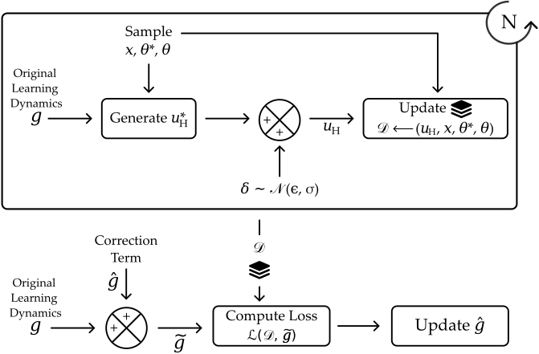

# StROL: Stabilized and Robust Online Learning from Humans

This repository provides our implementation of StROL in two different simulation environments and on a 7-DoF Franka Emika Panda robot arm.

## Dependencies
You need to have the following libraries with [Python3](https://www.python.org/):

- [Numpy](https://numpy.org/)
- [SciPy](https://scipy.org/)
- [PyTorch](https://pytorch.org/)
- [Tkinter](https://wiki.python.org/moin/TkInter)
- [pygame](https://www.pygame.org/news)
- [tqdm](https://tqdm.github.io/)

## Installation
To install StROL, clone the repo using
```bash
git clone https://github.com/VT-Collab/StROL.git
```


## Implementation of StROL
In StROL, we modify the learning dynamics of the system to incorporate a correction term in order to make learning from noisy and suboptimal actions more robust.

$$
\tilde g = g + \hat g
$$

The block diagram below shows the methodology used to generate the dataset using the given online learning rule $g$ and use that dataset to train the correction term $\hat g$

<center>
    
    <br>
    <div align="center">
        Figure 1: Framework of offline training of StROL.
    </div>
</center>

For our implementation we formulate the correction term $\hat g$ as a fully connected neural network.

Next, we explain the implementation of StROL in different simulation environments. We define the online learning rule $g$ and discuss the hyperparameters used for training.

### Highway Environment
In this setting, a robot car (a car controlled by a robot) is driving in front of a human car (a car controlled and driven by a human). Both the cars start in the left lane on a two-lane highway. The action and state space for both the cars is 2-dimensional, i.e. $x, u \in \mathbb{R}^2$. The goal of the robot car is to minimize the distance travelled and avoid any collisions with the human car. In this 2-lane highway setting, we assume two possible priors: (a) the human car will change lanes and pass the robot from the right and (b) the human car will tailgate the robot car till it gives way to the robot car. Note that prior (b), the human car does not care about the minimum distance from the robot car but wants to avoid collisions.

Below, we define the features and the online learning rule $g$ used for getting the above described behavior of the robot and the human. 

#### Features
- Distance between the cars $d = x_{\mathcal{R}} - x_{\mathcal{H}}$
- Speed of the robot car $v$
- Heading direction of the human car $h$

The learning rule of the robot $g$ is defined as the change in the features at each timestep

$$
g = [d^{t+1} - d^t, \max(0.25, v^{t+1} - v^t), -h]
$$

To train StROL for the Highway environment, move to the corresponding folder
```bash
mkdir simulations/CARLO
```

To train a the correction term $\hat g$, run the following command
```bash
python3 test_ours.py --train
```

We provide a trained model for the environment with $10\%$ noise and $0$ bias in the human actions. You can test the performance of this pre-trained model by running the following command
```bash
python3 test_ours.py --eval
```

This script will run the evaluation script for the Highway environment for StROL and the baselines and save a plot for the performance of the different approached.

In order to test the trained model with different noise and bias levels, you can provide the noise using `--noise` and `--bias` arguments respectively.
The full list of arguments for training and testing and their default values can be seen in `test_ours.py`

### Robot Environment
In this environment, a simulated human is trying to convey thier task preferences to the robot. The action and state spaces in this environment are both 3-dimensional, i.e. $x, u \in \mathbb{R}^3$. For training, the robot is randomly initialized in the environment and the simulated human provides corrections in order to convey their task preferences. The environment consists of two objects --- a plate and a cup. We model the prior in this environment as a bimodal distribution where the human can teach the robot either (a) to move to the cup and avoid the plate or (b) to move to the plate while avoiding the cup.

The features used in this environment and the robot's original learning dynamics $g$ are defined below.

#### Features
- 2-D distance of the robot's end-effector from the plate $d_p$
- 3-D distancs of the robot's end-effector from the cup $d_c$

The learning rule $g$ for the robot is defined as

$$
g = [d_p^{t+1} - d_p^t, d_c^{t+1} - d_c^t]
$$

Let $\theta = \{\theta_p, \theta_c\}$ be the reward parameters. The reward function of the task is defined as

$$
\mathcal{R}(\theta) = \theta_p \cdot d_p + \theta_c \cdot d_c
$$

### User Study
In our in-person user-study, the participants interact with a 7-DoF Franka Emika Panda robot arm to teach it 3 different tasks. The state and action space for one task is 3-dimensional, i.e. $x, u \in \mathbb{R}^3$, while for the other two tasks the state and action spaces are 6-dimensional ($x, u \in \mathbb{R}^6$). The robot is carrying a cup and its workspace consists of 2 objects (a pitcher and a plate). For the $1st$ task, the robot had access to three features, while for the $2nd$ and $3rd$ task the robot was given 4 features. For all tasks, $\hat g$ was trained with multinormal priors with number of possible tasks equal to the number of features.

The features for the task and the original learning rule $g$ of the robot for the user study are illustrated below


## Results

## Computational Overheads
