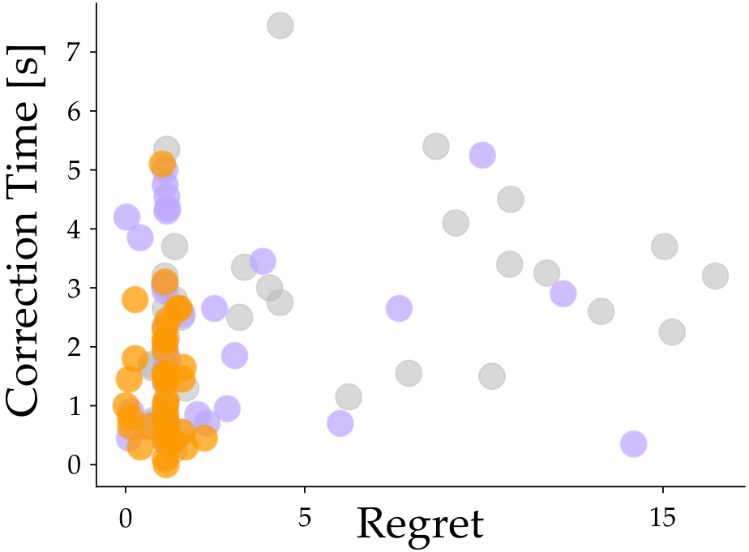

# StROL: Stabilized and Robust Online Learning from Humans

This repository provides our implementation of StROL in two different simulation environments and on a 7-DoF Franka Emika Panda robot arm.

## Dependencies
You need to have the following libraries with [Python3](https://www.python.org/):

- [Numpy](https://numpy.org/)
- [SciPy](https://scipy.org/)
- [PyTorch](https://pytorch.org/)
- [Tkinter](https://wiki.python.org/moin/TkInter)
- [pygame](https://www.pygame.org/news)
- [tqdm](https://tqdm.github.io/)

## Installation
To install StROL, clone the repo using
```bash
git clone https://github.com/VT-Collab/StROL.git
```


## Implementation of StROL
In StROL, we modify the learning dynamics of the system to incorporate a correction term in order to make learning from noisy and suboptimal actions more robust.

$$
\tilde g = g + \hat g
$$

The block diagram below shows the methodology used to generate the dataset using the given online learning rule $g$ and use that dataset to train the correction term $\hat g$

<center>
    <div align="center">
        
        <br>
        Figure 1: Framework of offline training of StROL.
    </div>
</center>

For our implementation we formulate the correction term $\hat g$ as a fully connected neural network.

Next, we explain the implementation of StROL in different simulation environments. We define the online learning rule $g$ and discuss the hyperparameters used for training.

### Highway Environment
This experiment is performed in the 2-D driving simulator CALRO [[1]](#references). In this setting, a robot car (a car controlled by a robot) is driving in front of a human car (a car controlled and driven by a human). Both the cars start in the left lane on a two-lane highway. The action and state space for both the cars is 2-dimensional, i.e. $x, u \in \mathbb{R}^2$. The goal of the robot car is to minimize the distance travelled and avoid any collisions with the human car. In this 2-lane highway setting, we assume two possible priors: (a) the human car will change lanes and pass the robot from the right and (b) the human car will tailgate the robot car till it gives way to the robot car. Note that prior (b), the human car does not care about the minimum distance from the robot car but wants to avoid collisions.

Below, we define the features and the online learning rule $g$ used for getting the above described behavior of the robot and the human. 

#### Features
- Distance between the cars $d = x_{\mathcal{R}} - x_{\mathcal{H}}$
- Speed of the robot car $v$
- Heading direction of the human car $h$

The learning rule of the robot $g$ is defined as the change in the features at each timestep

$$
g = [d^{t+1} - d^t, \max(0.25, v^{t+1} - v^t), -h]
$$

For the Highway environment, move to the corresponding folder using
```bash
cd simulations/CARLO
```

To train a the correction term $\hat g$, run the following command
```bash
python3 test_ours.py --train
```

We provide a trained model for the environment with $10\%$ noise and $0$ bias in the human actions. You can test the performance of this pre-trained model by running the following command
```bash
python3 test_ours.py --eval
```

This script will run the evaluation script for the Highway environment for StROL and the baselines --- Gradient , One [[2]](#references), MOF [[3]](#references) and e2e --- and save a plot for the performance of the different approached.

In order to test the trained model with different noise and bias levels, you can provide the noise using `--noise` and `--bias` arguments respectively.
The full list of arguments for training and testing and their default values can be seen in `test_ours.py`

### Robot Environment
In this environment, a simulated human is trying to convey thier task preferences to the robot. The action and state spaces in this environment are both 3-dimensional, i.e. $x, u \in \mathbb{R}^3$. For training, the robot is randomly initialized in the environment and the simulated human provides corrections in order to convey their task preferences. The environment consists of two objects --- a plate and a cup. We model the prior in this environment as a bimodal distribution where the human can teach the robot either (a) to move to the cup and avoid the plate or (b) to move to the plate while avoiding the cup.

The features used in this environment and the robot's original learning dynamics $g$ are defined below.

#### Features
- 2-D distance of the robot's end-effector from the plate $d_p$
- 3-D distancs of the robot's end-effector from the cup $d_c$

The learning rule $g$ for the robot is defined as

$$
g = [d_p^{t+1} - d_p^t, d_c^{t+1} - d_c^t]
$$

Let $\theta = \{\theta_p, \theta_c\}$ be the reward parameters. The reward function of the task is defined as

$$
\mathcal{R}(\theta) = \theta_p \cdot d_p + \theta_c \cdot d_c
$$

For training the $\hat g$ for the Robot environment, move to the corresponding folder using
```bash
cd simulations/robot
```

And then run 
```bash
python3 test_ours.py --train
```
This will train $\hat g$ to expand the basins of attraction and enable learning from noisy and biased actions for the default noise and bias values set in `test_ours/py`. To change the noise and bias values, provide `--noise` and `--bias` as arguments with the training command.

We provide a pretrained model for $\tilde g$ in the `g_data/g_tilde/model_2objs_500`. To test StROL in the Robot environment, run
```bash
python3 test_ours.py --eval --boltzmann
```
This code uses a model of the human that always chooses the optimal actions for the given reward function to provide corrections to the robot (noise and bias are added after the optimal action is chosen). The simulated human, by default, chooses their actions from a binormal distribution of tasks. To use a uniform prior for the tasks, add the argument `--uniform` when running the script. The results for the runs for all approaces will be saved in `/results'.

### User Study
In our in-person user-study, the participants interact with a 7-DoF Franka Emika Panda robot arm to teach it 3 different tasks. The state and action space for one task is 3-dimensional, i.e. $x, u \in \mathbb{R}^3$, while for the other two tasks the state and action spaces are 6-dimensional ($x, u \in \mathbb{R}^6$). The robot is carrying a cup and its workspace consists of 2 objects (a pitcher and a plate). For the $1st$ task, the robot had access to three features, while for the $2nd$ and $3rd$ task the robot was given 4 features. For all tasks, $\hat g$ was trained with multinormal priors with number of possible tasks equal to the number of features.

The tasks, features for the tasks and the original learning rule $g$ of the robot for the user study are illustrated below.

#### Features
- Distance from the plate $d_{plate}$
- Distance from the pitcher $d_{pitcher}$
- Height from the table $h$
- Orientation of the end-effector $O_{ee}$

#### Tasks
- Task 1: The robot starts at a fixed position, holding a cup upright. The users taught the robot to move to the plate while avoiding the pitcher and keeping the cup close to the table.

- Task 2: The robot starts at a fixed position, holding the cup in a tilded position. The users taught the robot to carry the cup upright while moving to the plate, avoiding the pitcher and moving close to the table.

- Task 3: The robot starts in a similar pose as Task 2. The users taught the robot to carry the cup upright, while moving away from the plate, the pitcher and the table.

Note that Task 1 and Task 2 were incorporated in the prior, while Task 3 was a new task that was not included in the prior.

To implement StROL in a user study, move to the `user_study` folder using
``` bash
cd user_study
```

The pre-trained model of $\tilde g$ for Task 1 is saved in `g_data/model_t1`, and the pre-trained model for Task 2 and Task 3 is saved in `g_data/model_t2'.
To run tests on the robot, run the following command:
```bash
python3 user_study.py --eval --alg <algorithm> --task <task number> --env_dim <3/6> --n_features <3/4>
```
`--alg` defines the algorithm being used for the test - 'strol', 'oat' or 'mof', `--task` takes in the task number, i.e. 1, 2 or 3, `--env_dim` should be 3 for Task 1 and 6 otherwise and `--n_features` is 3 for Task 1 and 4 for the other tasks. If you want the robot to play the optimal robot trajectory for a given task use `--demo` argument when running the script.


## Results

### Highway Simulation
In the Highway environment, the robot car observes the actions and updates its estimate of the human car's task parameters. The performance of the algorithms is quantifies by the error in the estimate of the human car's task parameters. 

The performance of different learning approaches averaged over 250 runs for the highway simulation are tabulated below:

<center>
<div align="center">

|      **Condition**     |              |             | **Methods** |             |             |
|:----------------------:|:------------:|:-----------:|:-----------:|:-----------:|:-----------:|
|                        | **Gradient** |   **One**   |   **MOF**   |   **e2e**   |  **StROL**  |
|      **Training**      |  0.59 ± 0.36 | 0.51 ± 0.37 | 0.58 ± 0.36 | 0.48 ± 0.08 | 0.31 ± 0.06 |
|  **0% Noise 0% Bias**  |  0.55 ± 0.36 | 0.53 ± 0.35 | 0.56 ± 0.37 | 0.48 ± 0.08 | 0.30 ± 0.08 |
| **50% Noise 50% Bias** |  1.18 ± 0.48 | 1.18 ± 0.41 | 1.08 ± 0.48 |  1.18 ± 0.6 |  1.09 ± 0.6 |
|    **Uniform Prior**   |  1.07 ± 0.43 |  1.1 ± 0.45 | 1.01 ± 0.42 |  0.98 ± 0.4 | 0.10 ± 0.42 |

</div>
</center>

### Robot Simulation
In this environment, the simulated interacts with the robot to provide corrections over 5 timesteps to convey their desired task parameters. The performance of the robot is measured in terms of regret as

$$
Reg = \sum_{x \in \xi^*} \mathcal{R} 
$$

The results for the Robot simulation for different approaches averaged over 100 runs are tabulated below:

<center>
<div align="center">

|      **Condition**     |              |              |  **Methods** |             |               |
|:----------------------:|:------------:|:------------:|:------------:|:-----------:|:-------------:|
|                        | **Gradient** |    **One**   |    **MOF**   |   **e2e**   |   **StROL**   |
|      **Training**      |  0.18 ± 0.37 | 0.20 ±  0.38 | 0.12 ±  0.29 | 3.69 ± 0.89 | 0.001 ± 0.004 |
|  **0% Noise 0% Bias**  |  0.10 ± 0.26 |  0.14 ± 0.33 |  0.06 ± 0.18 | 3.86 ± 0.95 |  0.01 ± 0.08  |
| **50% Noise 50% Bias** |  0.77 ± 0.84 |  0.44 ± 0.68 |  0.47 ± 0.59 | 3.25 ± 1.36 |  0.16 ±  0.83 |
|    **Uniform Prior**   |  0.17 ± 0.47 |  0.18 ± 0.50 |  0.18 ± 0.46 | 1.12 ± 0.49 |  0.12 ± 0.34  |

</div>
</center>

We also performed simulated experiments in this environment to study the effect that the relative weight of $g$ and $\hat g$ has on the online learning from humans. We write the equation for modified learning dynamics as 

$$
\tilde g = g + \lambda \cdot \hat g
$$

We vary the value of lambda from 0.5 to 10 and report the results for two different testing conditions --- (a) when the simulated human model matches that of training and (b) when the simulated human uses a prior different from the training conditions. 

<center>
    <div align="center">
        
        <br>
        Figure 2: Performance of StROL with varying relative weights of $g$ and $g_hat$.
    </div>
</center>

We observe that the relative weight of $g$ and $\hat g$ does not have a significant effect on the performance of StROL when the simulated human takes actions according to the prior of tasks. However, if the simulated human tries to teach a task different from priors, the baselines significantly outperfrom StROL with when $\lambda = 5, 10$. However, when the relative weight of $\hat g$ is similar to that of $g$, StROL performs similar to the baslelines

Next, we move on to test the efficacy of StROL when the user teaching the task changes their desired task parameters midway through the interaction. In this simulation, the simulated human always chooses a task from the prior. For the first 2 timesteps, the human provides corrections for one task from the prior and for the remaining 3 timesteps provides corrections for the other task. The performance of the robot using different approaches is summarized in the plot below.

<center>
    <div align="center">
        
        <br>
        Figure 3: Performance of StROL with varying relative weights of $g$ and $g_hat$.
    </div>
</center>

We observe that the using StROL, the simulate humans able to convey their task preferences to the robot more efficiently even if their preferences changed in between the interaction.

### User Study
In our user study, we measure the performance of a the robot by measuring the regret in performing the task and the time for which the users proivided corrections to the robot to convey their intended task. The gifs of the users teaching different tasks to the robot in the user study can be seen below:

#### **Task 1**
<center>
    <div align="center">
        
        
        
        <br>
        Figure 4: Users teaching Task 1 using different approaches
    </div>
</center>

#### **Task 2**
<center>
    <div align="center">
        
        
        
        <br>
        Figure 5: Users teaching Task 3 using different approaches
    </div>
</center>

#### **Task 3**
<center>
    <div align="center">
        
        
        
        <br>
        Figure 6: Users teaching Task 3 using different approaches
    </div>
</center>


 The  averages objective results for all tasks in the user study are shown below:

<center>
<div align="center">

|        **Metric**       |                | **Methods** |              |
|:-----------------------:|:--------------:|:-----------:|:------------:|
|                         |     **One**    |   **MOF**   |   **StROL**  |
|        **Regret**       | 4.904 ± 1.125  | 2.42 ± 0.48 |  1.03 ± 0.08 |
| **Correction Time (s)** |   2.50 ± 1.57  | 2.22 ± 1.53 | 1.382 ± 1.40 |

</div>
</center>

We also plot the the Correction Time vs Regret for all tasks and approaches in a scatter plot to analyze the effort that the users had to exert in order to convey their task parameters to the robot:

<center>
    <div align="center">
        
        <br>
        Figure 3: Performance of StROL with varying relative weights of $g$ and $g_hat$.
    </div>
</center>

## Hardware Requirements and Computational Overheads

The offline learning of the correction term was performed on a system with 8 cores and 16 GB Memory (GPU was not used for training). 
The offline training times for different experiments are tabulated below.

<center>
<div align="center">

| **Experiment**  | **# of Training Steps** | **Training Time (mins)** |
|:---------------:|:-------------------------:|:------------------------:|
|   **Highway**   |          1000             |       ~105 minutes       |
|    **Robot**    |           500             |        ~10 minutes       | 
| **User Study**  |          2000             |        ~45 minutes       | 

</div>
</center>

The offline training is performned only once for a given environment and a set of priors. The correction term $\hat g$ does not update when learning inline from human feedback. 

The user study is performed on a 7-DoF Franka Emika Panda robot arm. After the user provides feedback to convey their task preferences to the robot, the robot's estimate of the reward parameters is updated in real time (a delay of ~ 2-4 sec). This time delay is similar to the baselines in the user study that also learn in real time form the human feedback. Note that this is the observed delay in learning when performing the experiments on the above specified setup. This delay may differ for different settings and hardware setups.

## Citation
```bash
@article{mehta2023strol,
  title={StROL: Stabilized and Robust Online Learning from Humans},
  author={Mehta, Shaunak A and Meng, Forrest and Bajcsy, Andrea and Losey, Dylan P},
  journal={arXiv preprint arXiv:2308.09863},
  year={2023}
}
```

## References

[[1]](https://www.roboticsproceedings.org/rss16/p039.html) Z. Cao, E. Biyik, W. Z. Wang, A. Raventos, A. Gaidon, G. Rosman, and D. Sadigh, “Reinforcement learning based control of imitative policies for near-accident driving,” in RSS, July 2020.

[[2]](https://journals.sagepub.com/doi/full/10.1177/02783649211050958) D. P. Losey, A. Bajcsy, M. K. O’Malley, and A. D. Dragan, “Physical interaction as communication: Learning robot objectives online from human corrections,”  JRR, vol. 41, no. 1, pp. 20–44, 2022.

[[3]](https://ieeexplore.ieee.org/abstract/document/9007490) A. Bobu, A. Bajcsy, J. F. Fisac, S. Deglurkar, and A. D. Dragan, “Quantifying hypothesis space misspecification in learning from human–robot demonstrations and physical corrections,” IEEE Transactions on Robotics, vol. 36, no. 3, pp. 835–854, 2020